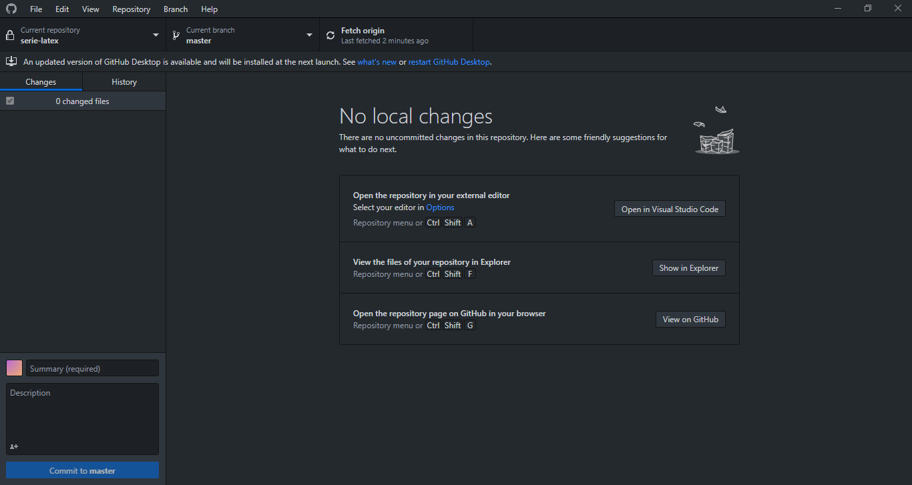

# SERIE LATEX

## DOWNLOADS
* Download Latex: https://www.latex-project.org/
* Download Texmaker: https://www.xm1math.net/texmaker/

-> In alternativa si può utilizzare [Visual Studio Code](https://code.visualstudio.com/) con l'estensione [Latex Workshop](https://marketplace.visualstudio.com/items?itemName=James-Yu.latex-workshop)

## UTILITIES
* Generatore tabelle: https://www.tablesgenerator.com/
* Generatore matrici: https://www.matheretter.de/rechner/matrix
* Editor di equazioni online: https://www.codecogs.com/latex/eqneditor.php
* Simboli:
1. [Generali](https://www.youmath.it/come-scrivo-le-formule-matematiche.html)
2. [Integrali, sommatorie e limiti](https://www.overleaf.com/learn/latex/Integrals,_sums_and_limits)
* "Learn":
1. [Matrici](https://www.overleaf.com/learn/latex/Matrices)
2. [Tabelle](https://www.overleaf.com/learn/latex/Tables#Reference_guide)
## SCARICARE FILES
  **clone or download > download zip**
  
## CLONARE I FILE

### SCARICARE
1. Scaricare [GitHub Desktop](https://desktop.github.com/)
2. **clone or download > open in desktop**
3. Non modificare il campo superiore (*Repository URL or Github uername and repository*), ma inserire nel campo inferiore (*Local Path*) la cartella nel quale verranno clonati i files (! è consigliato non modificarla)

### UTILIZZARE

1. Assicurarsi che in altro a sinistra sotto *current repository* ci sia il nome *serie-latex*
2. Controllare se non ci sono modifiche ai files attraverso *Fetch origin*. Nel caso in cui ci siano scaricarle ricliccando il tasto che sarà rinominato *Pull origin* (! Scaricandole il proprio lavoro fatto che non è stato precedentemente condiviso o salvato andrà perso)
3. È ora possibile modificare i files nella cartella in cui sono stati salvati. (Eventualmente è possibile cliccare *Repository > Show in Explorer* per aprire la cartella)
4. Per inviare le modifiche (che saranno visibili nella barra a sinistra) inserire un breve testo nel campo *Summary* e cliccare *Commit to **master***
5. Cliccare poi il tasto *Push Origin* in alto al centro-sinistra per inviare le modifiche.

